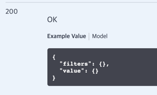

## 🤗 인프런 `Spring Boot를 이용한 RESTful Web Services 개발` 강의에서 다룬 내용 간략한 정리  

### * 기본적인 REST API 구현 (UserController.java)
- 유저 조회 GET /users /user/{id}
- 유저 추가 POST /users
- 유저 수정 PUT /users/{id}
- 유저 삭제 DELETE /users/{id}

### * 예외 처리 (CustomizeResponseEntityExceptionHandler.java)
- @ControllerAdvice 과 @ExceptionHandler 이용
- 기존 다른 프로젝트에서 처리하던 방식과 조금 차이나는 부분은 ResponseEntityExceptionHandler 를 상속받아서 필요한 메서드를 오버라이딩 했다는 정도
- 다른 프로젝트에서는 예외를 직접 잡았었는데 (MethodArgumentNotValidException.class) 여기에서는 오버라이딩으로 처리

### * 다국어 처리
1. LocaleResolver를 빈으로 등록
2. 메시지로 사용할 파일 이름 설정 (application.yml 의 spring: messages: basename: xxx)
3. 다국어 처리가 필요한 API 에서 Accept-Language 헤더를 통해 국가를 받음 (ex. fr,en / @RequestHeader 사용)
4. MessageSource 라는 빈이 등록되어 있는데 거기에서 Locale 값에 따라 준비된 메시지를 꺼내준다.

### * JSON 이 아닌 XML 로 응답 받기
클라이언트에서 요청할 때 헤더에 Accpet = application/xml 를 담아서 전달.
- 서버에서 준비되어 있지 않다면 406 예외를 (Not Acceptable) 응답

신기하게 pom.xml 에 아래 의존성 추가하면 xml로 잘 반환함
```xml
<dependency>
    <groupId>com.fasterxml.jackson.dataformat</groupId>
    <artifactId>jackson-dataformat-xml</artifactId>
</dependency>
```

### * 응답에서 특정 필드 제외하기 
현재 DTO 대신 User 도메인을 컨트롤러에서 바로 사용중
1. User 도메인에 외부에 노출하지 않을 필드가 있다 (password, ssn) 
2. User 도메인에 설정 추가 (아래 둘 중 하나) 
- a. @JsonIgnore 추가하여 노출하지 않을 필드에 각각 추가
- b. 클래스 위에 아래처럼 한번에 추가  
```java
@JsonIgnoreProperties(value = {"password", "ssn"})
public class User {...}
```

### * 특정 상황에만 응답에서 필드 제외하기
- 상황
a. AdminUserController: id, name, joinDate, ssn 응답
b. UserController: id, name, joinDate 응답
  
- 사용
1. User.java 에 @JsonFilter(id} 추가 
```java
@JsonFilter("UserInfo")
public class User {...}
```
2. AdminUserController.java 의 단일 조회 API 에 아래 같은 필터를 이용하여 필드를 선택하는 코드 추가
```java
@GetMapping("/{id}")
public MappingJacksonValue retrieveUser(@PathVariable int id) {
    User user = userDaoService.findOne(id);
    if (user == null) {
        throw new UserNotFoundException(String.format("ID[%s] not found", id));
    }
    // jackson 이 가지고 있는 클래스들
    SimpleBeanPropertyFilter filter = SimpleBeanPropertyFilter.filterOutAllExcept("id", "name", "joinDate", "ssn");
    FilterProvider filterProvider = new SimpleFilterProvider().addFilter("UserInfo", filter);

    MappingJacksonValue mappingJacksonValue = new MappingJacksonValue(user);
    mappingJacksonValue.setFilters(filterProvider);
    return mappingJacksonValue;
}
```
3. 불편한 점 
- a 상황은 성공했지만, b 상황을 처리하기 위해 유사한 코드를 UserController.java 에 추가해야 한다.
- b 상황 이외에도 기존 API 들에서 바디로 User를 응답하던 부분을 호출하면필터를 찾지 못했다는 에러가 발생한다.
- 하나의 도메인에 대한 여러 종류의 필터를 만들 수 있고 빈으로 등록하고 클래스 마다 다르게 적용하는 구조가 있어야 할 것 같은데,
- @JsonFilter 안의 id 가 String 값인 것을 보니 한 필터에서 처리해야할 것 같다는 생각이 든다. 
- 무식한 방법으로는 어떤 컨트롤러인지에 따라 분기문으로 처리하는 방법이 떠오르는데, 이럴거면 기존 프로젝트에서 유사한 상활을 처리할 때 쓰던 DTO 를 각자 두는게 더 좋아보인다.
- 내가 Jackson 의 사용법을 잘 몰라서 편하게 처리하는 방법이 있음에도 모르고 있을 가능성이 크지만, 
  강의에서 JsonFilter 를 사용하는 이점을 같은 도메인을 필요에 따라 필드를 제어할 수 있다는 점을 들어주셨고, 그런 동작을 만들 수 있지만 너무 불편한 것 같다는 생각이 든다.   
  
### * 버전 관리

- UriPath
```java
@GetMapping("/v1/users/{id}")
```
- QueryParam
```java
@GetMapping(value = "/users/{id}", params = "version=1")
```
- Header
```java
@GetMapping(value = "/users/{id}", headers = "X-API-VERSION=1")
```
- MIME 타입 이용: 요청 헤더의 Accept 에 아래처럼 넣어줌 
```java
@GetMapping(value = "/users/{id}", produces = "application/vnd.company.appv1+json")
```

### * HATEOAS 설정 (Hypermedia As the Engine Of Application State)
- 현재 리소스와 연관된 자원 상태 정보를 제공

- 예시 코드
```java
@GetMapping("/users/{id}")
    public MappingJacksonValue retrieveUser(@PathVariable int id) {
        User user = userDaoService.findOne(id);
        if (user == null) {
            throw new UserNotFoundException(String.format("ID[%s] not found", id));
        }

        EntityModel<User> model = EntityModel.of(user);
        WebMvcLinkBuilder linkTo = linkTo(methodOn(this.getClass()).retrieveAllUsers());
        model.add(linkTo.withRel("all-users"));

        return applyFilter(model);
    }
```
- 응답
```
{
    "id": 1,
    "name": "aaa",
    "joinDate": "2022-01-14T05:19:27.537+00:00",
    "_links": {
        "all-users": {
            "href": "http://localhost:8088/users"
        }
    }
}
```

### * API Documentation (Swagger)

#### reference
https://springfox.github.io/springfox/docs/current/

#### 기본 설정
1. dependency 추가 (springfox-boot-starter)
2. config 파일 추가
```java
@EnableSwagger2
@Configuration
public class SwaggerConfig {

    @Bean
    public Docket api() {
        return new Docket(DocumentationType.SWAGGER_2);
    }
}
```

#### 이슈 
- 부트 버전 2.6.2를 사용하고 있었는데 싱행하면 에러가 발생
아래 이슈이고 딱히 해결책이 없어서, 버전을 2.4.5로 낮춤
https://github.com/springfox/springfox/issues/3791
  
- jackson 필터 적용하면 아래처럼 MappingJacksonValue 모델로 Example Value가 나오는데
꽤 찾아봤지만 해결하지 못하였음. 추후에 찾아보기

  
#### UI 문서 주소
http://localhost:8088/swagger-ui/index.html

#### UI 구성에 사용되는 JSON 파일
http://localhost:8088/v2/api-docs

```json
{
  "swagger": "2.0", 
  "info": {...}, // 버전, 라이센스 정보 등
  "host": "localhost:8088",
  "basePath": "/",
  "tags": [...], // 컨트롤러 정보
  "paths": [...], // API 상세 정보
  "definitions": [...] // 사용되는 객체들 정보
}
```

### * APIs Monitoring 

#### 기본 설정
1. dependency 추가 (spring-boot-starter-actuator)

#### 모니터링 가능한 api 확인
http://localhost:8088/actuator
```json
{
  "_links": {
    "self": {
      "href": "http://localhost:8088/actuator",
      "templated": false
    },
    "health-path": {
      "href": "http://localhost:8088/actuator/health/{*path}",
      "templated": true
    },
    "health": {
      "href": "http://localhost:8088/actuator/health",
      "templated": false
    },
    "info": {
      "href": "http://localhost:8088/actuator/info",
      "templated": false
    }
  }
}
```

#### 더 많은 모니터링 정보를 얻고 싶다면 application.yml에 추가
```yaml
management:
  endpoints:
    web:
      exposure:
        include: "*"
```


### * HAL (Hypertext Application Language) Browser
- HAL is a simple format that gives a consistent and easy way to hyperlink. 
- 사용시 참고: https://www.baeldung.com/spring-rest-hal

#### dependency 추가
```xml
<dependency>
    <groupId>org.springframework.data</groupId>
    <artifactId>spring-data-rest-hal-explorer</artifactId>
</dependency>
```

#### 아래 url에서 이용
http://localhost:8088/browser/index.html


### * Spring Security (간단 사용)

#### dependency 추가
```xml
<dependency>
    <groupId>org.springframework.data</groupId>
    <artifactId>spring-boot-starter-security</artifactId>
</dependency>
```

#### 실행
1. 기존에 잘 동작하던 API들이 Unauthorized 응답을 보냄
2. 서버 실행시 로그에 password가 생성되는데 사용해서 요청 (id: user, password: 로그에 있는 문자열)
3. 브라우저에서 GET API 실행하면 로그인창 뜨고
4. 포스트맨으로 실행하려면 Authorization의 Basic Auth에서 id, password 함께 보네기

#### 고정 ID, PW 사용
application.yml에 추가
```yaml
spring:
  security:
    user:
      name: ggyool
      password: password
```

#### SecurityConfig 추가
```java
@Configuration
public class SecurityConfig extends WebSecurityConfigurerAdapter {

    @Autowired
    public void configureGlobal(AuthenticationManagerBuilder auth) throws Exception {
        auth.inMemoryAuthentication()
                .withUser("abc")
                .password("{noop}1234")
                .roles("USER");
    }
}
```
